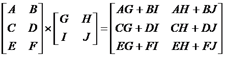
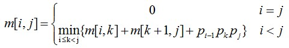
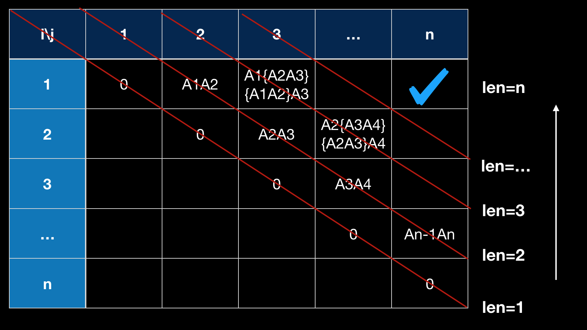

# 矩阵链乘最优解问题
## 输入
矩阵链个数及具体矩阵信息(矩阵名、矩阵行数、矩阵列数)，如：
```
3
A 10 20
B 20 30
C 30 40
```

## 输出
最小计算量，最优计算次序，最终输出矩阵行列数
```
rows: 10
cols: 40
cost: 18000
order: ((AB)C)
```

## 理解
### 动态规划
某些场景求解过程，可以分为若干决策阶段，每个阶段都需要做出最优决策，才能使整个场景问题得到最优解。动态规划算法就是面向这样多阶段决策问题，最终解依赖于每个阶段的决策，常表现为求最优解、最佳路径等问题。很像分治法，但区别在于，分治法能够将问题拆分为相互独立且于原问题形式相同的子问题，合并子问题的解可以得到最终解，而适用于动态规划求解的问题，拆分的子问题不是相互独立的，各阶段决策依赖于当前状态，又影响以后的发展，最终得到最优决策序列。
动态规划算法难点在于从实际问题中抽象出最优决策表，确定问题的阶段、状态、状态转移方程。

### 两个矩阵相乘的计算量  
  
前一个矩阵的列必须等于后一个矩阵的行才可相乘，`mxr`与`rxn`的矩阵相乘得到一个mxn的矩阵，计算量为`m*r*n`。

### 矩阵连乘最优解
问题：寻求`A1A2...An`连乘代价最低的结合顺序。  
根据最优子结构特性,以`A[i:j]`表示`AiAi+1...Aj`的连乘积，假设最优解在`k`处断开，`i<=k<j`，如果`A[i:j]`是最优的，那么`A[i:k]`和`A[k+1:j]`也是相应矩阵连乘的最优解。  
可以得到相应状态转移方程为：  


根据状态转移方程可以很简单地使用递归求出连乘的最优解，但是由于子问题的重叠性，造成很多冗余的重复计算。使用动态规划求解，核心在于下面的最优决策表:  
  
主要思路就是用空间换取时间，根据递归公式，自底向上计算，在计算过程中，保存已解决子问题的答案，每个子问题只计算一次，从而避免了大量重复计算。很容易得到下面的伪代码：
```
let list = Array[n,n];

for subLen = 2 to n
  for start = 0 to len-subLen
    for k = start to start+subLen-1
```

[传送门](https://github.com/coells/100days/blob/master/day%2002%20-%20matrix%20chain%20multiplication.ipynb)